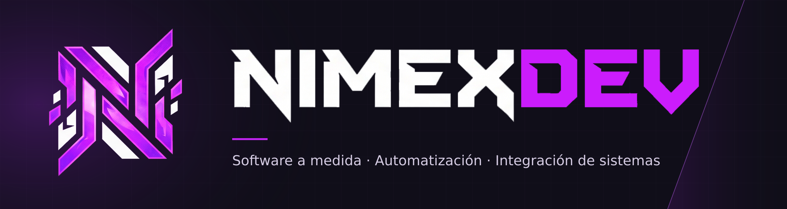

  

<h1 align="center">Hola, soy Jesús Mateos 👋</h1>

  <strong>Desarrollador Full Stack · C# / .NET · React / TypeScript · Laravel</strong> 
  De entender el proceso a poner la solución en marcha.

  
  
  

## Software que parte de un problema real

Soy desarrollador Full Stack y fundador de **NimexDEV**, desde La Rioja. Creo aplicaciones web, herramientas de gestión e integraciones que conectan personas, datos y dispositivos. Trabajo desde la toma de requisitos hasta el desarrollo, despliegue y mantenimiento.

Mi experiencia combina **desarrollo, sistemas y trabajo directo en producción y logística**. Conozco los procesos que después digitalizo: un fichaje, una reserva o un movimiento de almacén tienen personas y decisiones detrás.

- **Gestión empresarial:** modernización de procesos basados en Access y Excel, módulos ERP e integración de dispositivos de fichaje.
- **Industria y trazabilidad:** RFID, comunicación entre hardware y software y actualizaciones en tiempo real.
- **Servicios y comercio:** plataformas de citas, pagos, documentación, e-commerce y herramientas internas.
- **Infraestructura:** despliegues con Docker y Linux, servicios propios y soporte técnico a usuarios.

## Proyectos seleccionados

### NexusRFID · Trazabilidad conectada al almacén

Solución de trazabilidad RFID con un portal web, una API y un agente que se comunica con los lectores. Integra **Impinj OctaneSDK** y **SignalR** para trasladar las lecturas al sistema en tiempo real, con persistencia en PostgreSQL.

**Stack:** C# · ASP.NET Core · React · TypeScript · PostgreSQL · SignalR · Docker

**[Explorar el código →](https://github.com/Nimex92/NexusRFID)**

### Laura C. Moreno Nutrición · Gestión de una consulta

Plataforma para digitalizar **citas, pagos, documentación y comunicación con pacientes**. Incluye autenticación y autorización, pagos con Stripe e integraciones con Google Calendar y Google Meet.

**Stack:** Laravel · React · Stripe · Google Calendar / Meet · Docker

**[Visitar la web →](https://lauracmnutricion.es)**

### Lady Okira Leather · Del taller al comercio digital

E-commerce y backoffice a medida para una marca de artesanía en cuero. Reúne **catálogo, pedidos, facturación, presupuestos y gestión de contenido**, con Stripe Checkout y pruebas automatizadas con PHPUnit. Proyecto en fase de pre-lanzamiento.

**Stack:** Laravel · React · MariaDB · Stripe · Docker · PHPUnit

También he participado en la **modernización del ERP de Grupo Logístico Arnedo**, pasando de procesos en Access y Excel a módulos web con Laravel y MySQL, e integrando fichajes mediante C# y APIs REST. En el **Ayuntamiento de Quel**, asumí el desarrollo de una plataforma municipal con contenidos, agenda, turismo, reservas e integración con dispositivos.

## Tecnologías con las que trabajo

  
  
  
  
  
  

| Área | Tecnologías y herramientas |
| --- | --- |
| Backend | C#, .NET / ASP.NET Core, PHP, Laravel, Python, Java, APIs REST |
| Frontend | React, TypeScript, JavaScript, HTML, CSS, Tailwind CSS, Blade |
| Datos | PostgreSQL, MySQL / MariaDB, SQL Server, Oracle / PL-SQL, SQLite, Entity Framework Core |
| Integraciones | SignalR, WebSockets, RFID, Impinj OctaneSDK, Stripe, Google Calendar / Meet |
| Sistemas y despliegue | Linux, Ubuntu Server, Docker Compose, VPS, Raspberry Pi, Traefik, Cloudflare Tunnels |
| Herramientas | Git, GitHub, GitLab, Jira, Trello, Swagger / OpenAPI, PHPUnit |

## Más código para explorar

| Proyecto | Qué hace | Tecnologías |
| --- | --- | --- |
| [NimexChatBot](https://github.com/Nimex92/NimexChatBot) | Bot de Telegram con agenda, gestión de grupos e integración con IA. | Python · Gemini |
| [StreamHub](https://github.com/Nimex92/StreamHub) | Aplicación web para cargar listas M3U y reproducir canales HLS, con búsqueda y favoritos. | React · TypeScript · Node.js · Docker |

## Lo que sigo explorando

Me interesa profundizar en **testing, seguridad, arquitectura de software y automatización con IA**. Mi laboratorio también pasa por Linux, Docker y servicios propios: entender cómo se construye una aplicación y cómo se mantiene funcionando.

## ¿Hablamos?

Estoy abierto a **oportunidades de desarrollo, colaboraciones y proyectos de software a medida**. Si necesitas conectar sistemas, automatizar una tarea o convertir un proceso manual en una herramienta útil, podemos empezar por el problema que quieres resolver.

**[Portfolio](https://nimex.dev) · [LinkedIn](https://www.linkedin.com/in/jesusmateosmartos) · [nimex@nimex.es](mailto:nimex@nimex.es)**
